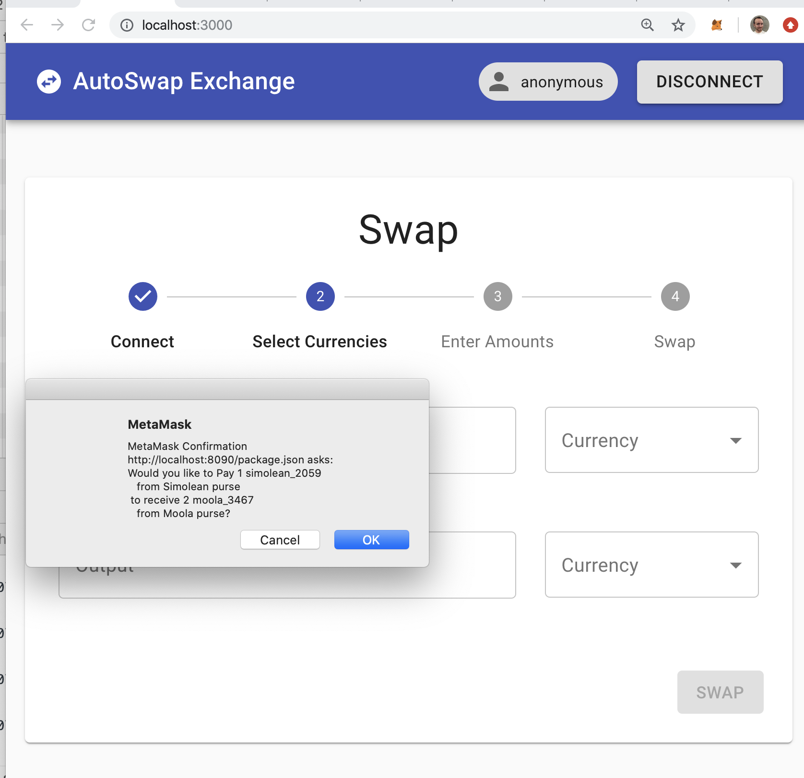

# MetaMask Agoric Plugin

Built for the [2019 SF Blockchain Week DeFi Hackahton](https://hackathon.sfblockchainweek.io/).

[Hackathon Entry Page](https://devpost.com/software/agoric-in-metamask-in-agoric)



A [MetaMask Plugin](https://medium.com/metamask/introducing-the-next-evolution-of-the-web3-wallet-4abdf801a4ee) capable of allowing a MetaMask user to interact with Dapps on the [Agoric blockchain](https://github.com/agoric/agoric).

This is the first plugin that allows MetaMask to connect to a non-Ethereum blockchain!

Notable in part because the MetaMask plugin system is itself built on Agoric's [Secure EcmaScript](https://github.com/agoric/ses) project, which is also the runtime for their blockchain.

## To Run

Several commands should be run at once to run this demo.

### Run an Agoric blockchain

In the root directory:
```
npm install -g agoric
agoric install
agoric start
```

### Host the Dapp UI

In the `ui` directory:

```
npm install
npm run start
```

### Host the Plugin

In the `metamask-plugin` directory:

```
npm i -g mm-plugin
mm-plugin serve
```

## Use the App

Navigate to `http://localhost:8000/wallet/` to see the wallet UI, with pending offers.

Navigate to `http://localhost3000` to see the exchange UI.

